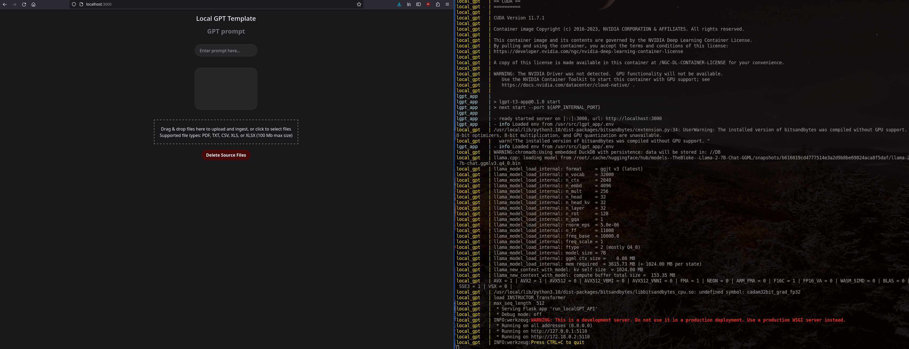

# T3 template project for Local GPT
This project shows an example implementation of Local GPT with a web interface built with the T3 stack.<br>
<br>
	- Check out the Local GPT project here: https://github.com/PromtEngineer/localGPT<br>
    - Check out T3 here: https://github.com/t3-oss/create-t3-app<br>
## Getting Started
To run this project you first need to install Docker and Docker Compose, 
follow the instructions located here: https://docs.docker.com/engine/install/
to install Docker and here: https://docs.docker.com/compose/install/ to install Docker Compose.<br>
<br>
Once you have both installed on your system, you can clone this repo with:

```
git clone https://github.com/pete3n/localGPT_T3-Template.git
```
Or download and unzip the project.<br>
Navigate to the root directory that contains the docker-compose.yml. If you are executing from a Linux
command line run:<br>
```
sudo docker-compose up
```
Or run with Administrator privileges from a Windows command line or Powershell with:<br>
```
docker-compose up
```
Note: it will take several minutes to download and build the containers for the first time.
There is ~10Gb worth of data required between both the app container and local GPT container.<br>
<br>
Once the containers are started, you should be able to navigate your browser to localhost:3000
(or whatever port you used for the application container, if you modified the .env file) and
see the web interface:<br>
<br>

<br>
Once the service has finished processing the SOURCE_DOCUMENTS you should see the Flask server
listening for requests as shown on the right.<br>
<br>
## Project Overview

Both the app and gpt containers are configured with the docker-compose.yml in the 
root project directory and pull environment variables from the .env file.<br>
<br>
### Changes to Local GPT
The changes I made to the Local GPT Dockerfile are:<br>
```
# Use port mappings from docker-compose from .env
ARG GPT_LISTENING_IP
ARG GPT_INTERNAL_PORT
ENV GPT_LISTENING_IP=${GPT_LISTENING_IP}
ENV GPT_INTERNAL_PORT=${GPT_INTERNAL_PORT}

# These are included for troubleshooting
RUN apt-get install -y vim netcat

# Prevent SOURCE_DOCUMENTS from being empty causing a looping container
COPY constitution.pdf /SOURCE_DOCUMENTS

# Modify the Flask API server parameters so it will listen on the configured interface and port
RUN echo "GPT_LISTENING_IP=${GPT_LISTENING_IP} and GPT_INTERNAL_PORT=${GPT_INTERNAL_PORT}"
RUN sed -i "s|app.run(.*)|app.run(debug=False, host='${GPT_LISTENING_IP}', port=${GPT_INTERNAL_PORT})|" /run_localGPT_API.py

CMD python run_localGPT.py --device_type $device_type
```
This allows configuring the API to listen outside the container on a port specified in the environment file.<br>
The localGPT_docker directory contains a seperate docker-compose.yml which can be used to launch
the Local GPT container separately from the app container.<br>

### Changes to T3
[lgpt-t3-app/src/pages/api/trpc/\[trpc\].ts](pages/api/trpc/\[trpc\].ts)

Added config block to allow for 100mb GET/POST bodies:<br>
```
export const config = {
    api: {
            bodyParser: {
                sizeLimit: '100mb',
            },
        responseLimit: '100mb'
    }
};
```


